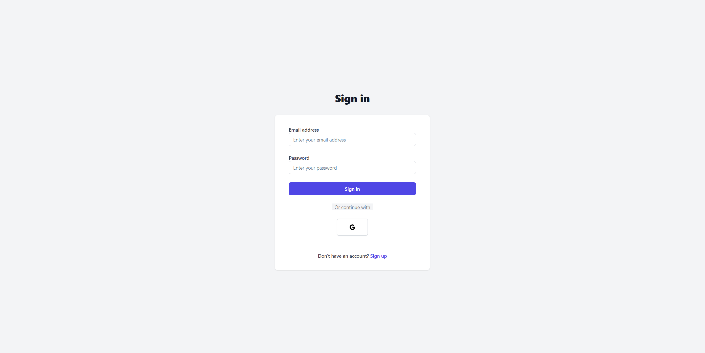
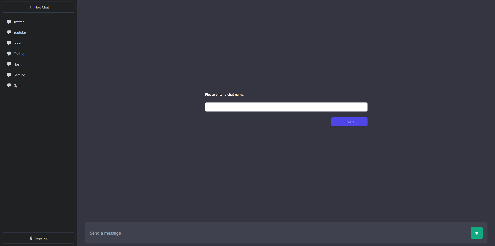
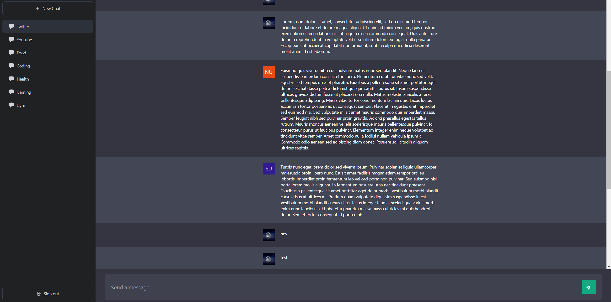

# ChatAI

Welcome to ChatAI, a real-time chat application with a sleek and intuitive UI inspired by **ChatGPT**. This documentation serves as a comprehensive guide on how to utilize and understand the features of this innovative application.

## Table of Contents

- [Demo](#idemo)
- [Installation](#installation)
- [Vue 3 and Vite](#vue-3-and-vite)
- [Additional Packages](#additional-packages)
- [Authentication](#authentication)
- [Creating Chats](#creating-chats)
- [Real-time Messaging](#real-time-messaging)
- [Screenshots](#screenshots)
- [Contributing](#contributing)
- [License](#license)

## Demo
Check out the live demo of this project [here](https://sunnyzaman-chat-ai.vercel.app/).

## Installation

To get started with ChatAI, follow these steps:

1.  Clone the repository to your local machine. 
	```bash
	git clone https://github.com/SunnyZaman/ChatAI.git
	``` 
2.  Navigate to the project directory.
	```bash
	cd ChatAI
	``` 
3.  Install dependencies using your preferred package manager. For example, with npm:
	```bash
	npm install
	``` 
4.  Create an environment file (`.env`) with the required Firebase configuration variables 
	```env
	# Firebase Configuration
	VITE_API_KEY=your_api_key
	VITE_AUTH_DOMAIN=your_auth_domain
	VITE_PROJECT_ID=your_project_id
	VITE_STORAGE_BUCKET=your_storage_bucket
	VITE_MESSAGING_SENDER_ID=your_messaging_sender_id
	VITE_ID=your_id
	```
	Replace "your_api_key," "your_auth_domain," etc., with the actual values provided by your Firebase project. These values are essential for ChatAI to connect to Firebase and enable authentication and real-time messaging features. Make sure to keep this information confidential and secure.
    
6.  Run the application.
    
    bashCopy code
    
    `npm run dev` 
    
## Vue 3 and Vite

Chat-AI is built with Vue 3 and Vite. Vue 3 provides a reactive and efficient UI, while Vite offers a fast development environment. Familiarize yourself with Vue and Vite documentation for any customization or further development.

## Additional Packages 

Chat-AI utilizes the following packages to enhance its functionality:

-   **vee-validate:** Used for form creation and validation.
-   **vue-tippy:** Provides tooltips to improve the user interface.
-   **vue3-toastify:** Displays toasts for authentication errors.
-   **@heroicons/vue:** Offers a collection of icons to enhance the visual appeal of the app.

Feel free to explore these packages for more details on their usage and customization.

## Authentication

ChatAI supports two methods of authentication:

1.  **Email and Password:** Users can sign in using their email and password.
2.  **Google Provider:** Users have the option to log in using their Google account.

Authentication is managed through Firebase, ensuring a secure and reliable authentication process.

## Creating Chats

Users can create new chats, similar to servers. These chats serve as conversation spaces where users can exchange messages in real-time. To create a new chat:

1.  Navigate to the chat creation interface.
2.  Provide a name and any additional details for the new chat.
3.  Confirm the creation to start chatting.

## Real-time Messaging

Chat-AI provides a real-time messaging experience. Users can send and receive messages instantly within their chats. Messages are updated in real-time across all connected users, creating a seamless communication environment.

## Screenshots

| Authentication                          | New Chat                | Messages |
| ----------------------------------- | --------------------------------- | --------------------------------- |
|  |  |  |
| **Description**: This screenshot captures the authentication page where users can sign in to the ChatAI application. Users have the option to sign in using their email and password or through their Google account. | **Description**: In this screenshot, users are prompted to create a new chat. They can enter a title and provide additional details for the chat, setting the foundation for a new conversation space within the application. | **Description**: This screenshot showcases the messaging interface inside a chat. Users can exchange real-time messages within the chat, creating a dynamic and responsive communication environment. |

## Contributing

Contributions are welcome! If you have ideas for improvements or new features, follow these steps to contribute:

1.  Fork the repository on GitHub.
2.  Clone your forked repository to your local machine.
3.  Make your changes or add new features.
4.  Test your changes thoroughly.
5.  Create a pull request to merge your changes back into the original repository.


## License

This project is open-source and available under the [MIT License](https://en.wikipedia.org/wiki/MIT_License). You are free to use, modify, and distribute this project as you see fit.